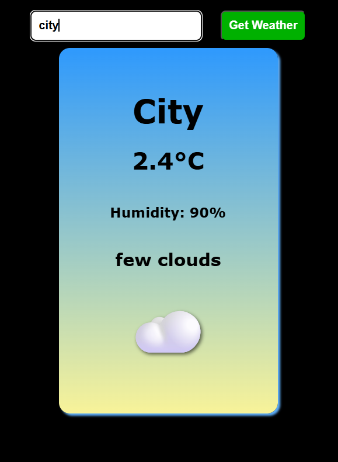

# Weather-App
# 🌦️ Weather App

A simple and clean weather app built using **HTML**, **CSS**, and **JavaScript**. It allows users to search for any city and get current weather data such as temperature, humidity, description, and an emoji representing the weather condition.



## 🔧 Features

- Real-time weather data using the OpenWeatherMap API
- Clean UI with responsive card layout
- Dynamic emoji for weather conditions
- Input validation with error handling
- Font size adjustment for long city names
- Shadow effect on weather emoji

## 🖼️ Demo

You can try a live demo of the project here:  
**[[Live Demo Link](https://surya821.github.io/Weather-App/)](#)** 

## 🚀 Getting Started

### Prerequisites

- A modern web browser
- Internet connection (to access the weather API)

### Installation

1. Clone the repository:
   ```bash
   git clone https://github.com/your-username/weather-app.git
